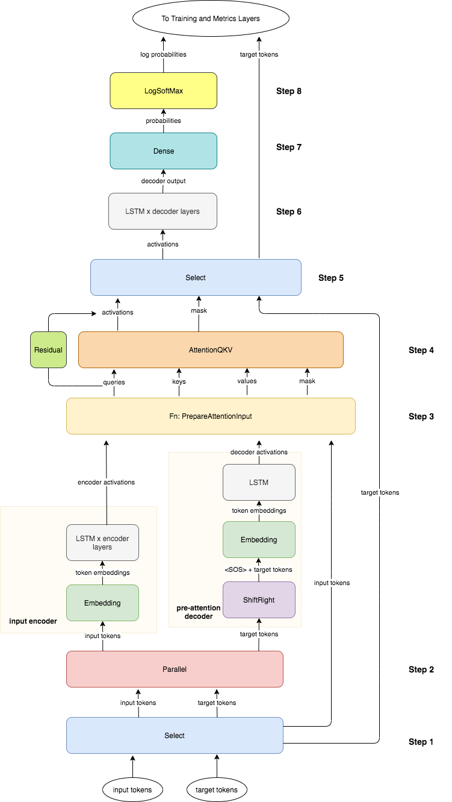

# Neural-Machine-Translation-with-Attention

This is the first project I have built in the **Natural Language Processing with Attention Models** course in Coursera.

This readme is taken exactly from the project description in the Notebook itself.

Here, you will build an English-to-German neural machine translation (NMT) model using Long Short-Term Memory (LSTM) networks with attention.  Machine translation is an important task in natural language processing and could be useful not only for translating one language to another but also for word sense disambiguation (e.g. determining whether the word "bank" refers to the financial bank, or the land alongside a river). Implementing this using just a Recurrent Neural Network (RNN) with LSTMs can work for short to medium length sentences but can result in vanishing gradients for very long sequences. To solve this, you will be adding an attention mechanism to allow the decoder to access all relevant parts of the input sentence regardless of its length. By completing this assignment, you will:  

- learn how to preprocess your training and evaluation data
- implement an encoder-decoder system with attention
- understand how attention works
- build the NMT model from scratch using Trax
- generate translations using greedy and Minimum Bayes Risk (MBR) decoding 
## Outline
- Part 1:  Data Preparation
    - 1.1  Importing the Data
    - 1.2  Tokenization and Formatting
    - 1.3  tokenize & detokenize helper functions
    - 1.4  Bucketing
    - 1.5  Exploring the data
- Part 2:  Neural Machine Translation with Attention
    - 2.1  Attention Overview
    - 2.2  Helper functions
        - Exercise 01
        - Exercise 02
        - Exercise 03
    - 2.3  Implementation Overview
        - Exercise 04
- Part 3:  Training
    - 3.1  TrainTask
        - Exercise 05
    - 3.2  EvalTask
    - 3.3  Loop
- Part 4:  Testing
    - 4.1  Decoding
        - Exercise 06
        - Exercise 07
    - 4.2  Minimum Bayes-Risk Decoding
        - Exercise 08
        - Exercise 09
        - Exercise 10
